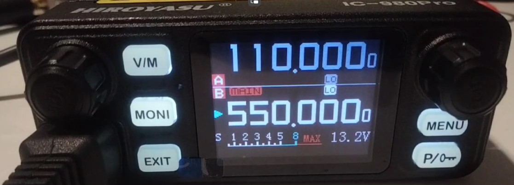
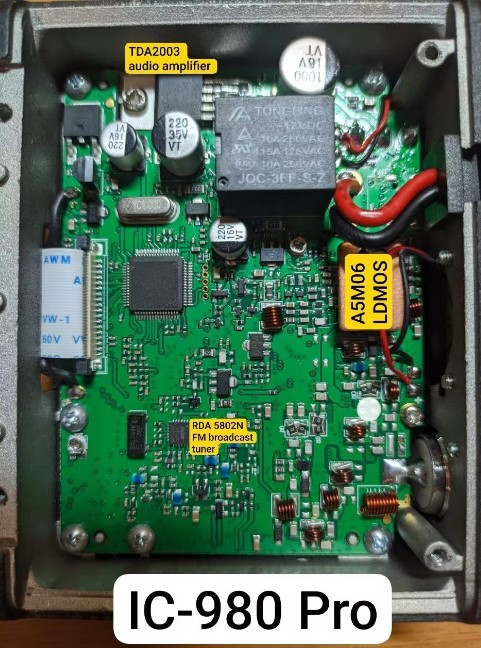
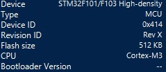
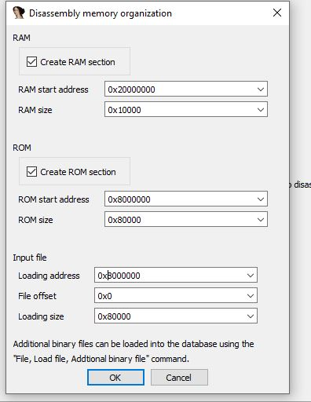

# 🔍Ingeniería inversa del Hiroyasu IC-980 Pro (VHF/UHF)

## 📝Descripción general

Este proyecto se centra en el análisis técnico del transceptor de radio VHF/UHF **Hiroyasu IC-980 Pro**, un dispositivo de origen chino. La iniciativa forma parte de un proceso de ingeniería inversa con fines educativos y de experimentación electrónica, con el objetivo de desentrañar cómo opera este equipo tanto a nivel de hardware como de firmware.

### 🎯 Objetivos del proyecto

🔹 **Estudiar y entender el firmware** original del dispositivo, a través de técnicas de extracción y análisis.  
🔹 **Mapear y documentar los componentes internos del hardware**, su arquitectura y conexiones.  
🔹 **Detectar oportunidades de mejora o modificación**, ya sea para ampliar funciones existentes o corregir limitaciones del sistema original.  
🔹 Facilitar información, herramientas y recursos a otros entusiastas o aficionados que deseen investigar y realizar pruebas con el dispositivo de manera autónoma, bajo su propia responsabilidad.

### 🧩 Componentes identificados

Durante la apertura y exploración del equipo se encontraron los siguientes componentes:

🔹 **STM32F101 / STM32F103**: Microcontrolador de 32 bits de la familia ARM Cortex-M3, usado para el control general del sistema.  
🔹 **BoyaMicro 25D16AS**: Memoria flash SPI, probablemente usada para almacenar configuraciones internas.  
🔹 También se incluyen otros componentes relevantes como **TDA2003** amplificador de audio, chip FM broadcast, transistores, relés y otros componentes electrónicos. 

### 🛠️ Proceso técnico (resumen)

🔹 Se desmontó la carcasa del equipo para acceder a la PCB principal.  
🔹 Se identificó y leyó el contenido de la memoria flash SPI.  
🔹 Se conectó el puerto **SWD** al microcontrolador con el J-Link para permitir la extracción de   parte del firmware, usando esta técnica no se puede extraer el 100 % del firmware.  
🔹 Se prepararon scripts y herramientas compatibles con OpenOCD, IDA Pro para la extracción y el análisis del código extraído.

### 📸 Imágenes del análisis

🔹 Vista interna parte superior.

🔹 Imagen del chip SPI Flash, situado por la parte abajo PCB.

🔹 Conexión del puerto SWD para la extracción con el J-link u otros.

    
🔹 Respuesta para detectar el microcontrolador.

### Ficheros y configuración

🔹 BY25D16AS@40SOP8-208.BIN Extracción de datos con programador de la memoria SPI ubicada en la parte trasera.  
🔹 openocd.py : Para la extracción del firmware.  
🔹 firmloader.py : Cargar en IDA Pro y poder analizar el STM32Fxxx.  
🔹 Configuración para IDA

🔹Método 1 usando la técnica de los siguiente link:

https://gitlab.zapb.de/zapb/stm32f1-firmware-extractor  
https://github.com/doegox/stm32f1-firmware-extractor/tree/master

## 🧪 Técnicas por explorar 
     Método 2

🔹 [CTXz/stm32f1-picopwner: Dump read-out protected STM32F1's with a Pi Pico - A Pi Pico implementation of @JohannesObermaier's, Marc Schink's and Kosma Moczek's Glitch and FPB attack to bypass RDP (read-out protection) level 1 on STM32F1 chips](https://github.com/CTXz/stm32f1-picopwner)

Gracias a todos los que comparten su conocimiento y tiempo en comunidades de ingeniera inversa, electrónica y hacking. Este proyecto es posible gracias a la curiosidad de muchos, quiero expresar mi sincero agradecimiento a **Mecanico**  de Hardware Hacking por su valiosa ayuda y animarme a realizar esta publicación. 